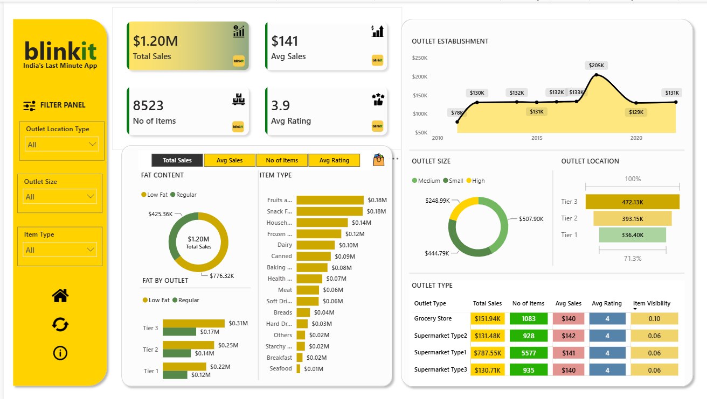

# Blinkit Grocery Sales Dashboard 📊

## 📌 Project Overview

This project presents an interactive **Blinkit Grocery Sales Dashboard** built in **Power BI** to analyze sales performance, outlet characteristics, product categories, customer ratings, and location-level performance.

The dashboard transforms raw grocery sales data into meaningful business insights through interactive visualizations and KPIs.

## 📊 Dashboard Preview



## 🎯 Project Objectives

- Analyze overall sales performance using key KPIs
- Compare sales performance across different outlet types
- Understand the relationship between outlet size, location, and sales
- Analyze sales performance by item type and fat content
- Evaluate sales trends based on outlet establishment
- Compare average sales, number of items, and customer ratings
- Identify high-performing outlet segments and areas for optimization

## 📈 Key KPIs

| KPI | Value |
|---|---:|
| Total Sales | $1.20M |
| Average Sales | $141 |
| No. of Items | 8,523 |
| Average Rating | 3.9 |

## 🔍 Key Insights

- **Supermarket Type1** contributes the highest share of total sales.
- **Tier 3 locations** generate the highest sales among outlet locations.
- **Medium-sized outlets** contribute significantly to overall sales.
- **Fruits and Vegetables** and **Snack Foods** are among the leading item categories.
- **Regular-fat products** contribute a larger share of sales compared with low-fat products.
- Sales performance varies across outlet establishment years, with a notable peak in later years.

## 🗂️ Dataset

The project uses the **Blinkit Grocery Sales dataset**, containing information related to:

- Item Type
- Item Fat Content
- Item Visibility
- Item Sales
- Item Rating
- Outlet Type
- Outlet Size
- Outlet Location
- Outlet Establishment Year

Dataset file:

`Blinkit_Grocery_Data.csv`

## 🛠️ Tools & Technologies

- **Power BI**
- **DAX**
- **Power Query**
- Data Cleaning
- Data Transformation
- Data Modeling
- Data Visualization
- Dashboard Design
- KPI Analysis

## 📊 Dashboard Features

- Interactive filter panel
- Total Sales KPI
- Average Sales KPI
- Total Items KPI
- Average Rating KPI
- Outlet establishment trend
- Outlet size analysis
- Outlet location analysis
- Item type sales analysis
- Fat content analysis
- Outlet type performance table

## 📁 Project Files

```text
Blinkit-Sales-Dashboard/
│
├── README.md
├── Blinkit_Dashboard.png
├── Blinkit_Grocery_Data.csv
└── Blinkit_Dashboard.pbix

## 👩‍💻 Author

**Somya Singhal**

Aspiring Data Analyst | Power BI | SQL | Excel | Data Visualization
